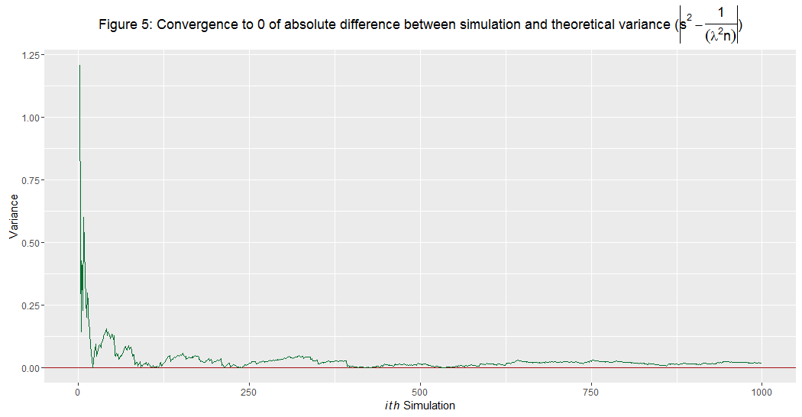

```{r setup, include=FALSE}
knitr::opts_chunk$set(echo = TRUE)
```

## Overview

One of the goals of this simulation is to compare the theoretical mean and the theoretical variance of the exponential distribution with the sample means variance from distributions created by simulaiton. of the sampling distribution of the mean. Another goal is to show that the sampling distribution, by the Central Limit Theorem, is approximately normal.  Code for the project is included in the Appendix.

A caution is that each execution of the code produces a new distribution.  The appearances of the graphs will change.

## Simulations
R contains several functions that generate distribution variates directly.  The R function to create exponential variates, rexp, takes two parameters.

* ***lambda*** is the rate parameter of the exponential distribution

* ***n*** is the number of observations


```r
set.seed(100)

lambda <- 0.2; 
N <- 1000; 
n <- 40
```
Given these values, the theoretical mean, standard deviation and variance can be calculated.

* ***Mean*** = $\frac{1}{lambda}$ or $\frac{1}{0.2}$ or 5 

* ***Standard deviation*** = $\frac{1}{lambda}$ or $\frac{1}{0.2}$ or 5 

* ***Variance*** = $\frac{1}{{lambda}^{2}*n}$ or $\frac{1}{{0.2}^{2}*40}$   or 0.625

It is important here to distinguish between n, the size of the sample being considered, and N, the number of replications of the value of the statistic to be simulated. The number of samp;es, n, will be small and N will be large.  N is large to get a realistic representation of the distribution so it would be close to the theoretical distribution. Simulations can be run with the following code using the rexp function. The following code generates N iterations of rexp.

```r
#run the simulation 1 to N times
dist_means<-apply(sapply(1:N, function(i) {rexp(n, lambda)}), 2, mean)

```
The N in the function call is the number of simulations to run.

* ***N*** is the number of simulations


## Sample Mean versus Theoretical Mean
The following plots compare the sample mean and the theoretical mean.  The theoretical mean is $\frac{1}{lambda}$ or $\frac{1}{0.2}$ or 5.  Figure 1 shows how the simulated mean compares to the theoretical mean. 


Another way to compare the individual sample means and the theoretical mean is to plot both and to plot the difference between individual sample means and the theoretical mean.  Figures 2 and 3 show the convergence of the sample mean to the theoretical mean and the convergence of the difference.  

#### Figures 2 and 3. Conversion of simulated mean to theoretical mean

<table>
  <tr>
  <td></td>
  <td></td>
  </tr>
</table>  

While the apparent peak in Figure 1 does not quite match up withe theoretical mean, Figures 2 and 3 show that as the number of iterations of the simulation increases the means converge and the differences converge to 0.


## Sample Variance versus Theoretical Variance

As with the means, the individual sample variance and the theoretical variance, $\frac{1}{{lambda}^{2}*n}$  or 0.625, and the difference between individual sample variance and the theoretical variance are plotted.  Figures 4 and 5 show the convergence of the sample variance to the theoretical variance and the convergence of the absolute difference between the sample variance and the theoretical variance ($\frac{1}{{lambda}^{2}*n}$).  
 

#### Figures 4 and 5. Conversion of simulated variance to theoretical variance

<table>
  <tr>
  <td></td>
  <td></td>
  </tr>
</table>  

As with the simulated and theoretical means, Figures 4 and 5 show that as the number of iterations of the simulation increases the variances converge and the differences converge to 0.

## Distribution:

The Central Limit Theorem states that for the distribution of the sample mean follows approximately the normal distribution with a mean of $\frac{1}{lambda}$ and a standard deviation $\frac{1}{lambda}$, which are also mean and standard deviation of a population.  the shape of the distribution will tend to a normal or Gaussian shape as n gets large. Figure 6 shows this convergence.

Q-Q plots (quantile-quantile plots) are a visualization comparing two probability distributions by plotting their quantiles against each other. If the two distributions are similar, the points in the Q–Q plot will be on the y = x line. Figure 7 is a Q-Q plot of the 

#### Figures 6 and 7. Distribution of sample mean and Q-Q Plot

<table>
  <tr>
  <td></td>
  <td></td>
  </tr>
</table>  

Figure 8 shows the probability that the population mean is within confidence intervals.  For this plot, 95% was used.  Using $\frac{1}{lambda}$ = 5, the average of the sample mean falls within the confidence interval at least 95% of the time. 


## Appendix

Following are selections from the full code found at the hyperlink listed below.

Set the parameters for the exponential distribution and the simulation
```r
set.seed(100)
lambda <- 0.2; 
N <- 1000; 
n <- 40
```
Calculate the distribution of the simulated means.
```r
#use sapply to run 1 to N sims and apply to calculate the mean for each sim
dist_means<-apply(sapply(1:N, function(i) {rexp(n, lambda)}), 2, mean)
```
Plot the distribution
```r
title1 <- expression(
  paste(
    'Figure 1: Sampling Distribution of Simulated Mean (',
    bar(x), 
    ') compared to Theoretical Mean (',
    frac(1, lambda),
    ')')
)

p1<-ggplot(mapping=aes(x=dist_means)) +
  geom_histogram(bins=25, col=BuGn[2], fill=BuGn[1]) +
  geom_vline(xintercept=1 / lambda, col=BuGn[3], size=2) +
  labs(title=title1, x='Simulated Mean', y='Count')

p1
```
Calculate hte convergence of the simulated mean to the theoretical mean.

```r
cumul_means <- cumsum(dist_means) / seq_along(dist_means)
abs_diff_mean <- abs(cumul_means - (1 / lambda))
```

Plot the convergence of the simulated mean to the theoretical mean.

```r
title2 <- expression(paste('Figure 2: Convergence of simulated mean (',
                           bar(x), 
                           ') to the theoretical mean (', 
                           frac(1, lambda),
                           ')')
)

p2 <- ggplot(mapping=aes(x=seq_along(cumul_means), y=cumul_means)) +
  geom_hline(yintercept=1 / lambda, col=reds[3]) +
  geom_line(col=BuGn[3]) +
  labs(title=title2, x=expression(paste(italic(ith),' Simulation')), y='Simulated Mean')
p2
```

Plot the absolute difference

```r
title3 <- expression(paste('Figure 3: Convergence of absolute difference between simulated mean and theoretical mean, ', 
                           abs(bar(x) - frac(1, lambda))))

p3 <- ggplot(mapping=aes(x=seq_along(abs_diff_mean), y=abs_diff_mean)) +
  geom_hline(yintercept=0, col=reds[3]) +
  geom_line(col=BuGn[3]) +
  labs(title=title3, x=expression(paste(italic(ith),' Simulation')), y='Mean')
p3
```

Calculate the convergence of the simulated variance to the theoretical Variance.
```r
cumul_vars <- sapply(seq_along(dist_means),
                     function(x) {
                       var(dist_means[1:x])
                     })
```
Plot the convergence of the simulated and theoretical variance

```r
title4 <- expression(paste('Figure 4: Convergence of simulation variance (', s^2, ') to theoretical variance (', frac(1, (lambda^2 * n)),')'))
p4 <- ggplot(mapping=aes(x=seq_along(cumul_vars), y=cumul_vars)) +
  geom_hline(yintercept=(1 / (lambda^2 * n)), col=reds[3]) +
  geom_line(na.rm=T, col=BuGn[3]) +
  labs(title=title4, x=expression(paste(italic(ith),' Simulation')), y='Variance')
p4
```

Plot the absolute difference

```r
abs_diff_variance <- abs(cumul_vars - (1 / (lambda^2 * n)))

title5 <- expression(paste('Figure 5: Convergence to 0 of absolute difference between simulation and theoretical variance (', abs(s^2 - frac(1, (lambda^2 * n))), ')'))
p5 <- ggplot(mapping=aes(x=seq_along(abs_diff_variance), y=abs_diff_variance)) +
  geom_hline(yintercept=0, col=reds[3]) +
  geom_line(na.rm=T, col=BuGn[3]) +
  labs(title=title5, x=expression(paste(italic(ith),' Simulation')), y='Variance')
p5
```

Check normality by comparing shape of curves
```r
title6 <- expression(paste('Figure 6: Simulated Mean and Normal Distributions ',
                           italic(N) %~% (list(1 / lambda, 1 / (lambda * sqrt(n))))))
p6<-ggplot(mapping=aes(x=dist_means)) +
  geom_histogram(aes(y=..density..), bins=25, col=BuGn[2], fill=BuGn[1]) +
  stat_function(fun=dnorm,
                args=list(mean=1 / lambda, sd=1 / (lambda * sqrt(n))),
                col=BuGn[3], size=2) +
  labs(title=title6, x='Value', y='Density')+
  geom_vline(xintercept=1 / lambda, col=BuGn[3], size=2)
p6
```
Check normality with a Q-Q plot
```r
title7<-  'Figure 7: Q-Q plot of the simulation distribution'

p7<-ggplot(mapping=aes(sample=dist_means)) +
  geom_abline(intercept=1 / lambda, slope=1 / (lambda * sqrt(n)),
              col=reds[3]) +
  stat_qq(col=BuGn[2], fill=BuGn[1], alpha=0.1) +
  labs(title=title7,x='Theoretical quantiles', y='Sample quantiles')
p7
```
Check occurence of mean at 95% confidence interval
```r
seq_lambdas<- seq(3, 7, by=0.01)

#calculate coverage
coverage <- sapply(seq_lambdas, function(lamb) {
  mu_hats <- rowMeans(matrix(rexp(n*N, rate=0.2),N, n))
  lower_limit <- mu_hats - qnorm(0.975) * sqrt(1/lambda**2/n)
  upper_limit <- mu_hats + qnorm(0.975) * sqrt(1/lambda**2/n)
  mean(lower_limit < lamb & upper_limit > lamb)
}
)

title8<-  'Figure 8: Coverage (probability that population mean is in confidence interval)'

#coverage
p8<-qplot(seq_lambdas, coverage) + geom_hline(yintercept=0.95,col=reds[3])+
  labs(title=title8,x='Lambda', y='Probability (Coverage)')
p8
```

## System Information

The analysis was run with the following software and hardware.

```{r}
sessionInfo()
```

The source code for this document and the analysis is stored in GitHub at: 
https://github.com/wer61537/Statistical_Inference_Course_Project.  The R code is at https://github.com/wer61537/Statistical_Inference_Course_Project/blob/master/exponential_simulation.R.  The Markdown document is at https://github.com/wer61537/Statistical_Inference_Course_Project/blob/master/Exponential_Simulation.Rmd
