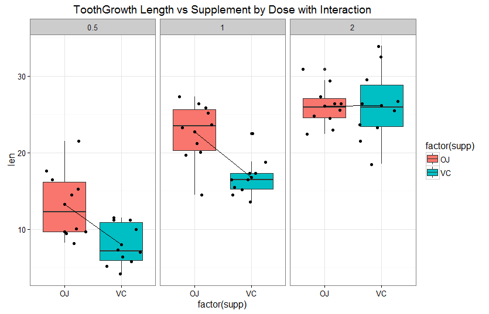
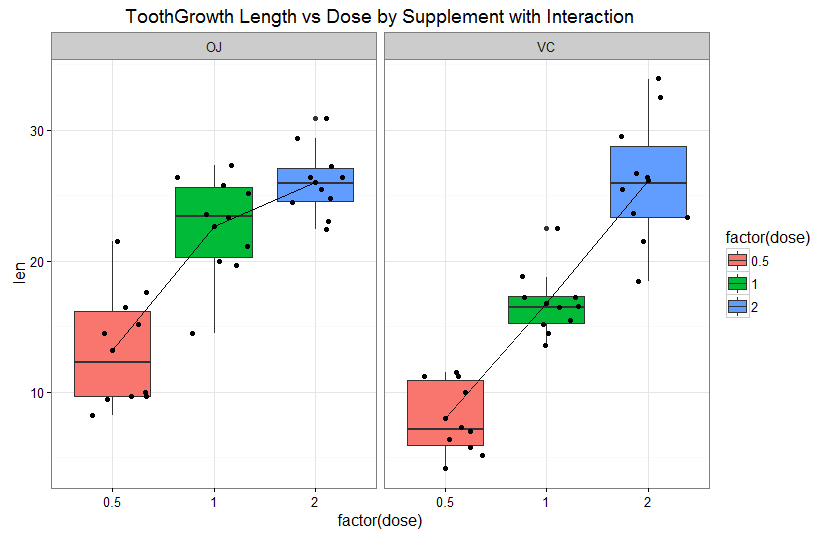

<style type="text/css">
/*  CSS chunck 1  */
th {  background-color:#E0E0E0 ;
      border-bottom:1px solid black;
      padding:5px;}

td{
border-bottom:1px dotted black;
padding:5px;}

table{ 
border-collapse:collapse;
margin:auto;
 border: 1px solid black;}
</style>
---
title: "Analysis of Ascorbic Acid Dose and Matrix Effects on Odontoblast Growth in Guinea Pigs"
author: "Bill Rowe"
date: "May 21, 2016"
output: html_document
---

```{r setup, include=FALSE}
knitr::opts_chunk$set(echo = TRUE)
```

## Executive Summary

Of all mammals, only the guinea pig, monkey and man can synthesise ascorbic acid (Vitamin C). Natural and synthetic ascorbic acid are the same chemically, citrus fruits, like oranges, and other natural sources of ascorbic acid havee other organic compounds like bioflavonoids which enhance the bioavailability of ascorbic acid.  Bioflavonoids have been shown to improve the utilisation of ascorbic acid and increase its storage in guinea pigs.   

The data is from a 1952 study where the length of odontoblasts (cells responsible for tooth growth) was measured in 60 guinea pigs in relation to administration of Vitamin C (via ascorbic acid (neat) or in orange juice). Dose levels of Vitamin C were 0.5, 1 and 2 mg/day.  It is important to note, the amounts in the data are the amounts of ascorbic acid after assay.  They are not ascorbic acid as is and the amount of orange juice. 

Dosage amount by itself showed significant differences while supplement type by itself did not.  The 0.5 and 1.0 mg/day doses showed significant differences by supplement type with ascorbic acid delivered in orange juice showed significantly longer odontoblast length compared to the ascorbic acid supplement. The 2.0 mg/day dose delivered in either supplement, does not show significant differences.

## Data Processing

### Data Source

The ToothGrowth data is included as a dataframe in base R. 

```r
data(ToothGrowth)
```

## Exploratory Data Analysis

### Data Elements
The toothgrowth data is stored as a dataframe of 60 observations with 3 variables:

```r
#get a look at the dataset
summary(ToothGrowth)
str(ToothGrowth)

#take a look at the unique values for each of the variables
unique(ToothGrowth$len)
unique(ToothGrowth$supp)
unique(ToothGrowth$dose)
```

The dataset contains the following variables :  

* **length** : numeric, odontoblasts length
* **supplement** : factor, supplement type (Direct administration of ascorbic acid coded as 'VC'
                  ascorbic acid delivered via orange juice coded as 'OJ').
* **dose** : numeric,	amount of ascorbic acid (in milligrams) administered each day (0.1, 1 or 2).  

There are 10 guinea pigs receiving 6 combinations ofsupplement type and dose level to yield 60 observations.  The experiment was designed to test the delivery dosage and mechanism.  Combinations of dose and supplement delivery are summarized in the following table.

```r
#Summary of guinea pigs given 0.5, 1.0 and 2.0 mg doses of Vitamin C and Orange Juice
t<-rbind(
  summary(ToothGrowth[which(ToothGrowth$dose==0.5 & ToothGrowth$supp=='VC'),]$len),
  summary(ToothGrowth[which(ToothGrowth$dose==1.0 & ToothGrowth$supp=='VC'),]$len),
  summary(ToothGrowth[which(ToothGrowth$dose==2.0 & ToothGrowth$supp=='VC'),]$len),
  
  summary(ToothGrowth[which(ToothGrowth$dose==0.5 & ToothGrowth$supp=='OJ'),]$len),
  summary(ToothGrowth[which(ToothGrowth$dose==1.0 & ToothGrowth$supp=='OJ'),]$len),
  summary(ToothGrowth[which(ToothGrowth$dose==2.0 & ToothGrowth$supp=='OJ'),]$len)
  
)
#set the row and column names
dimnames(t) <- list(
    c("0.5 mg Vitamin C", "1.0 mg Vitamin C", "2.0 mg Vitamin C",
      "1.0 mg Orange Juice","1.5 mg Orange Juice","2.0 mg Orange Juice"),
    c("Min.",    "1st Qu.", "Median",  "Mean",    "3rd Qu.", "Max."))

#show the table
t
print(xtable(t), type = "html")
```
<br><br>
***Table 1: Dose and Supplement Type Summary Statistics***

<table border=1>
<tr> <th>  </th> <th> Min. </th> <th> 1st Qu. </th> <th> Median </th> <th> Mean </th> <th> 3rd Qu. </th> <th> Max. </th>  </tr>
<tr> <td align="right"> 0.5 mg Vitamin C </td> <td align="right"> 4.20 </td> <td align="right"> 5.95 </td> <td align="right"> 7.15 </td> <td align="right"> 7.98 </td> <td align="right"> 10.90 </td> <td align="right"> 11.50 </td> </tr>
<tr> <td align="right"> 1.0 mg Vitamin C </td> <td align="right"> 13.60 </td> <td align="right"> 15.27 </td> <td align="right"> 16.50 </td> <td align="right"> 16.77 </td> <td align="right"> 17.30 </td> <td align="right"> 22.50 </td> </tr>
<tr> <td align="right"> 2.0 mg Vitamin C </td> <td align="right"> 18.50 </td> <td align="right"> 23.38 </td> <td align="right"> 25.95 </td> <td align="right"> 26.14 </td> <td align="right"> 28.80 </td> <td align="right"> 33.90 </td> </tr>
<tr> <td align="right"> 1.0 mg Orange Juice </td> <td align="right"> 8.20 </td> <td align="right"> 9.70 </td> <td align="right"> 12.25 </td> <td align="right"> 13.23 </td> <td align="right"> 16.18 </td> <td align="right"> 21.50 </td> </tr>
<tr> <td align="right"> 1.5 mg Orange Juice </td> <td align="right"> 14.50 </td> <td align="right"> 20.30 </td> <td align="right"> 23.45 </td> <td align="right"> 22.70 </td> <td align="right"> 25.65 </td> <td align="right"> 27.30 </td> </tr>
<tr> <td align="right"> 2.0 mg Orange Juice </td> <td align="right"> 22.40 </td> <td align="right"> 24.58 </td> <td align="right"> 25.95 </td> <td align="right"> 26.06 </td> <td align="right"> 27.08 </td> <td align="right"> 30.90 </td> </tr>
</table>

<br><br>

To get a sense of the distribution of data by supplement and dose and possible interactions between independent variables (dose and supplement), interactions were calculated and boxplots created.

```r
# calculate interactions
toothInt <- ddply(ToothGrowth,.(dose,supp),summarise, val = mean(len))

#create figure 1
ggplot(ToothGrowth, aes(x = factor(supp), y = len)) + 
  ggtitle("ToothGrowth Length vs Supplement by Dose with Interaction") + 
  geom_boxplot (aes(fill=factor(supp))) + geom_jitter() + facet_grid(.~dose) + 
  geom_point(data = toothInt, aes(y = val)) +
  geom_line(data = toothInt, aes(y = val, group = dose)) + 
  theme_bw()
```

<br><br>
***Figure 1:  Tooth Growth Length versus Supplement Grouped By Dose***


```r
# create figure 2
ggplot(ToothGrowth, aes(x = factor(dose), y = len)) + 
  ggtitle("ToothGrowth Length vs Dose by Supplement with Interaction") + 
  geom_boxplot (aes(fill=factor(dose))) + geom_jitter() + facet_grid(.~supp) + 
  geom_point(data = toothInt, aes(y = val)) +
  geom_line(data = toothInt, aes(y = val, group = supp)) + 
  theme_bw()
```

<br><br>
***Figure 2:  Tooth Growth Length versus Dose Grouped By Supplement***
(

By Figure 1, there does seem to be a larger response for vitamin C delivered by orange juice vs vitamin C delivered as ascorbic acid.  At the 2.0 mg level, there appears to be little difference.  The tooth growth response for vitamin by orange juice levels off at 2.0 mg.  The response for vitamin C by ascorbic acid does not level off. By Figure 2, there appears to be a higher response at the 0.5 and 1.0 levels for orange juice vs. direct administration of Vitamin C.

Another way to explore the data is to use Anova to explore interactions.

```r
anova.out <- aov(len ~ supp * dose, data=ToothGrowth)
summary(anova.out)
```
<br><br>
***Table 2: ANOVA Summary***  
<table border=1>
<tr> <th>  </th> <th> Df </th> <th> Sum Sq </th> <th> Mean Sq </th> <th> F value </th> <th> Pr(&gt;F) </th> <th></th> </tr>
<tr> <td> supp        </td> <td align="right"> 1 </td> <td align="right"> 205.35 </td> <td align="right"> 205.35 </td> <td align="right"> 12.32 </td> <td align="right"> 0.0009 </td><td>***</td> </tr>
<tr> <td> dose        </td> <td align="right"> 1 </td> <td align="right"> 2224.30 </td> <td align="right"> 2224.30 </td> <td align="right"> 133.42 </td> <td align="right"> 0.0000 </td><td>***</td> </tr>
<tr> <td> supp:dose   </td> <td align="right"> 1 </td> <td align="right"> 88.92 </td> <td align="right"> 88.92 </td> <td align="right"> 5.33 </td> <td align="right"> 0.0246 </td><td>*</td> </tr>
<tr> <td> Residuals   </td> <td align="right"> 56 </td> <td align="right"> 933.63 </td> <td align="right"> 16.67 </td> <td align="right" colspan="3">   </td> </tr>
<tr><td colspan=7></td></tr>
<tr><td colspan=7>Signif. codes:  0 *** 0.001 ** 0.01 * 0.05 . 0.1 blank 1</td></tr>
</table>

<br><br>
The ANOVA summary in Table 2 shows a strong relationship between the length of tooth growth and the dosage amount (p−value<2−16<0.01).  Supplement type also impacts tooth growth (p−value<0.000231<0.01).  Finally, there is a minor effect on tooth growth by supplement type and dose (p−value<0.021860<0.05).


### Hypotheses Testing
Confidence intervals and p-values can be used to test hypotheses about differences in sets of data.  While sample sizes in this dataset are the same, the variances are not: the group administered ascorbic acid directly (VC) has a variance of 68.33 while the group administered ascorbic acid by orange juice has a variance of 43.63.  Welch's two sample t-test is more reliable when the two samples have unequal variances and unequal sample sizes (not the case here) so seems appropriate.  The null hypothesis for each set of two samples will be that there is no (or 0) difference between their means. The alternative hypothesis, that there is real difference between the means (or not 0), will be accepted if the p-value of Welch's two sample t-test is less than 0.05.

Table 3 shows the 95% confidence intervals for the individual dose and supplement means.  The upper and lower confidence interval limits for the three dose amounts do not overlap.  However, the upper and lower confidence interval limits for supplement type do overlap.  The means that there may be signigicant differences in tooth growth due to dosage but perhaps not for supplement type due to the overlap.  

```r
#Caluculate the 95% confidence interval (c.i) each dose and each supplement
ci<-as.data.frame(
  list(
    round(t.test(ToothGrowth$len[ToothGrowth$dose==0.5])$conf.int,2),
    round(t.test(ToothGrowth$len[ToothGrowth$dose==1.0])$conf.int,2),
    round(t.test(ToothGrowth$len[ToothGrowth$dose==2.0])$conf.int,2),
    round(t.test(ToothGrowth$len[ToothGrowth$supp=='OJ'])$conf.int,2),
    round(t.test(ToothGrowth$len[ToothGrowth$supp=='VC'])$conf.int,2)
  )
)
#relabel
row.names(ci)<-c('Lower Limit','Upper Limit')
names(ci)<-c('0.5 mg/day','1.0 mg/day','2.0 mg/day','OJ','VC')
#generate html
print(xtable(ci), type = "html")
```
<br><br>

***Table 3: 95% Confidence Intervals for Each Dose and Supplement***
<table border=1>
<tr> <th>  </th> <th> 0.5 mg/day </th> <th> 1.0 mg/day </th> <th> 2.0 mg/day </th> <th> OJ </th> <th> VC </th>  </tr>
<tr> <td align="right"> Lower Limit </td> <td align="right"> 8.50 </td> <td align="right"> 17.67 </td> <td align="right"> 24.33 </td> <td align="right"> 18.20 </td> <td align="right"> 13.88 </td> </tr>
<tr> <td align="right"> Upper Limit </td> <td align="right"> 12.71 </td> <td align="right"> 21.80 </td> <td align="right"> 27.87 </td> <td align="right"> 23.13 </td> <td align="right"> 20.05 </td> </tr>
 </table>

<br><br>
The p-values for differences in dose in the Table 4 are less than 0.05.  However, the p-value for the two supplement types is greater than 0.05. For the doses, since the p-values are less than 0.05, the alternative hypotheses, that there are real non-zero differences in the means, is accepted.  However, for the supplement differences, the p-value greater than 0.05 means the null hypothesis, that the true difference between the supplement means is zero, cannot be rejected.

```r
pvalues<-as.data.frame(
  list(
    t.test(ToothGrowth$len[ToothGrowth$dose==0.5],ToothGrowth$len[ToothGrowth$dose==1])$p.value,
    t.test(ToothGrowth$len[ToothGrowth$dose==0.5],ToothGrowth$len[ToothGrowth$dose==2])$p.value,
    t.test(ToothGrowth$len[ToothGrowth$dose==1.0],ToothGrowth$len[ToothGrowth$dose==2])$p.value,
    t.test(ToothGrowth$len[ToothGrowth$supp=="VC"],ToothGrowth$len[ToothGrowth$supp=="OJ"])$p.value
  )
)
#relabel
row.names(pvalues)<-c('p-value')
names(pvalues)<-c('0.5 mg/day vs 1.0 mg/day','0.5 mg/day vs 2.0 mg/day','1.0 mg/day vs 2.0 mg/day','VC vs OJ')
#generate html
print(xtable(pvalues), type = "html")
```
<br><br>
***Table 4: P-Values for Each Dose and Supplement Comparison***
<br><br>
<table border=1>
<tr> <th>  </th> <th> 0.5 mg/day vs 1.0 mg/day </th> <th> 0.5 mg/day vs 2.0 mg/day </th> <th> 1.0 mg/day vs 2.0 mg/day </th> <th> VC vs OJ </th>  </tr>
<tr> <td align="right"> p-value </td> <td align="right"> 1.268301e-07 </td> <td align="right"> 4.397525e-14 </td> <td align="right"> 1.90643e-05 </td> <td align="right"> 0.06063451 </td> </tr>
</table>
<br><br>


```r
#get VC and OJ variance
var(ToothGrowth[which(ToothGrowth$supp=='VC'),]$len)
var(ToothGrowth[which(ToothGrowth$supp=='OJ'),]$len)
```

```r
#ci's for each combination of dose and supplement level
ci_combos<-as.data.frame(
  list(
    round(t.test(ToothGrowth$len[ToothGrowth$supp=="OJ" & ToothGrowth$dose==0.5])$conf.int,2),
    round(t.test(ToothGrowth$len[ToothGrowth$supp=="OJ" & ToothGrowth$dose==1])$conf.int,2),
    round(t.test(ToothGrowth$len[ToothGrowth$supp=="OJ" & ToothGrowth$dose==2])$conf.int,2),
    
    round(t.test(ToothGrowth$len[ToothGrowth$supp=="VC" & ToothGrowth$dose==0.5])$conf.int,2),
    round(t.test(ToothGrowth$len[ToothGrowth$supp=="VC" & ToothGrowth$dose==1])$conf.int,2),
    round(t.test(ToothGrowth$len[ToothGrowth$supp=="VC" & ToothGrowth$dose==2])$conf.int,2)
  )
)
#relabel
row.names(ci_combos)<-c('Lower Limit','Upper Limit')
names(ci_combos)=c('OJ @0.5 mg/day','OJ @1 mg/day','OJ @2 mg/day','VC @0.5 mg/day','VC @1 mg/day','VC @2 mg/day')
#generate html
print(xtable(ci_combos), type = "html")
```

As with the comparison of dosage levels and supplement types, combinations of the supplement type and dosage level are can be calculated.  Table 5 shows that there is no overlap in the confidence intervals for VC at each dosage level and for OJ at the first two dosage levels.  However, there is overlap between the OJ@1.0 mg/day and OJ@2.0 mg/day.  OJ@2.0 mg/day and VC @2.0 mg/day also have overlapping confidence intervals.

<br><br>
***Table 5: 95% Confidence Intervals for Dose and Supplement Combinations***
<table border=1>
<tr> <th>  </th> <th> OJ @0.5 mg/day </th> <th> OJ @1 mg/day </th> <th> OJ @2 mg/day </th> <th> VC @0.5 mg/day </th> <th> VC @1 mg/day </th> <th> VC @2 mg/day </th>  </tr>
<tr> <td align="right"> Lower Limit </td> <td align="right"> 10.04 </td> <td align="right"> 19.90 </td> <td align="right"> 24.16 </td> <td align="right"> 6.02 </td> <td align="right"> 14.97 </td> <td align="right"> 22.71 </td> </tr>
<tr> <td align="right"> Upper Limit </td> <td align="right"> 16.42 </td> <td align="right"> 25.50 </td> <td align="right"> 27.96 </td> <td align="right"> 9.94 </td> <td align="right"> 18.57 </td> <td align="right"> 29.57 </td> </tr>
</table>
<br><br>
For the dose and supplement cominbations, the p-values in Table 6 are very small, indicating that dose levels do have an effect on teeth growth. However, the p-value for the differences by supplment type is greater than 0.05.  Thus, the null hypothesis cannot be rejected, that is, supplement differences by themselves are not significant. 

```r
#p-values for combos
pvalues_combos<-as.data.frame(
  list(
    t.test(ToothGrowth$len[ToothGrowth$supp=="OJ" & ToothGrowth$dose==0.5],ToothGrowth$len[ToothGrowth$supp=="VC" & ToothGrowth$dose==0.5])$p.value,
    t.test(ToothGrowth$len[ToothGrowth$supp=="OJ" & ToothGrowth$dose==1],ToothGrowth$len[ToothGrowth$supp=="VC" & ToothGrowth$dose==1])$p.value,
    t.test(ToothGrowth$len[ToothGrowth$supp=="OJ" & ToothGrowth$dose==2],ToothGrowth$len[ToothGrowth$supp=="VC" & ToothGrowth$dose==2])$p.value
  )
)
#relabel
row.names(pvalues_combos)<-c('p-value')
names(pvalues_combos)<-c('VC vs OJ @0.5 mg/day','VC vs OJ @1.0 mg/day','VC vs OJ @2.0 mg/day')
#generate html
print(xtable(pvalues_combos), type = "html")
```
<br><br>
***Table 6: P-Values for Each Dose and Supplement Comparison***
<table border=1>
<tr> <th>  </th> <th> VC vs OJ with 0.5 mg/day </th> <th> VC vs OJ @1.0 mg/day </th> <th> VC vs OJ with 2.0 mg/day </th>  </tr>
<tr> <td align="right"> p-value </td> <td align="right"> 0.006358607 </td> <td align="right"> 0.001038376 </td> <td align="right"> 0.9638516 </td> </tr>
</table>

## Conclusions
For this project, the effects of different levels of ascorbic acid (vitamin C) (0.5, 1.0, and 2.0 mg/day) deliverd as supplements (in orange juice or as ascorbic acid ) on odontoblast length (tooth growth length) were investigated. Due to unequal variances between the two supplement groups, Welch's Two Sample t-test was used for hypothesis testing. It can be concluded that:

* **the dosage amount*** has significant impact on increasing odontoblast length. As the dosage increases, the increases.  This is most obvious in the group coded as "VC".  The group coded as "OJ" showed some leveling off at the 2.0 mg.day level.

* **the supplement type **, by itself shows no significant differences at the 95% confidence level.

* **the 0.5 and 1.0 mg/day doses** show significant differences by supplement type.  At doses of 0.5, and 1.0 mg/day, ascorbic acid delivered in orange juice showed significantly longer odontoblast length compared to the ascorbic acid supplement. 

* **the 2.0 mg/day dose**, does not show significant differences by supplement type.


## References
Blanc, B. and von der Mühll, M.  (1967) Interaction of a Flavonoid and Vitamin C: Its influence on the weight of the guinea pig and the vitamin C content of its organs. Int. Z. Vitaminforsch, 37, 156, 1967.

Bliss, C.I. (1952) The Statistics of Bioassay. Academic Press.

Cotereau, E.W., Gabe, M., Gero, E. and Parrot, J-L.  (1948) Influence of Vitamin C upon the amount of Ascorbic Acid in the organs of the Guinea Pig. Nature, 161, 557, 1948. 

Crampton, E.W. (1947) The growth of the odontoblast of the incisor teeth as a criterion of vitamin C intake of the guinea pig. The Journal of Nutrition 33(5): 491–504. While CRAN references this document, it is not available online.  http://jn.nutrition.org/content/33/5/491.full.pdf

Crampton, E.W. and Lloyd, L.E. (1950) A Quantitative Estimation of the effect of rutin on the biological potency of Vitamin. J. Nutr., 41, 487, 1950.   

McNeil, D.R. (1977) Interactive Data Analysis. New York: Wiley.

## System Information

The analysis was run with the following software and hardware.

```{r}
sessionInfo()
```

The source code for this document and the analysis is stored in GitHub at: 
https://github.com/wer61537/Servere_Weather_Events